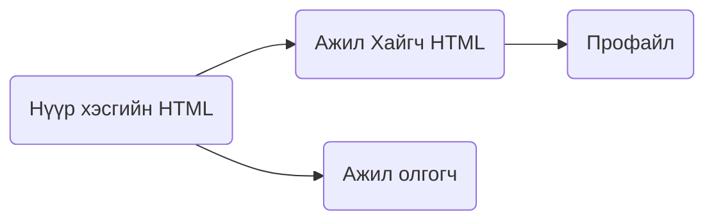

# Веб програмчлал
Одоогийн байгаа веб сайт нь хэрэглээ нь хязгаарлагдмал зөвхөн компани нэвтрэх цэстэй байгаа. Ажил горьлогч хүмүүс заавал гар утасны аппликейшн татаж ажлын хүсэлт илгээх ба ажлын зарыг апп-аасаа харна. 

Энэ нь веб сайтын хувьд маш том сул тал болж байгаа бөгөөд веб сайтыг зөвхөн танилцуулгын зориулалтаар ашиглаж байгаа. Ажил хайгч хүнд веб сайт нь ямар ч хэрэгцээгүй сайт болон хувирч байгаа учир манай баг үүнийг нь засан сайжруулах замаар вебийн  боломж болон хэрэглээг нэмэгдүүлнэ. Заавал гар утасны аппликейшн татах хэрэггүй веб сайтыг илүү их хүртээмжтэй болгох зорилт тавьж байна.
# Diagrams

# Sitemap
  
  
  

# Файлууд
```
 Index.html - Үндсэн html
 style.css 	- CSS
 ```

### Файл нэмэх:
>Шинээр зураг, файл нэмэх бол харгалзах **folder** дотор заавал тайлбар өгч хадгална.

