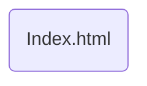

# Веб програмчлал
Одоогийн байгаа веб сайт нь хэрэглээ нь хязгаарлагдмал зөвхөн компани нэвтрэх цэстэй байгаа. Ажил горьлогч хүмүүс заавал гар утасны аппликейшн татаж ажлын хүсэлт илгээх ба ажлын зарыг апп-аасаа харна. 

Энэ нь веб сайтын хувьд маш том сул тал болж байгаа бөгөөд веб сайтыг зөвхөн танилцуулгын зориулалтаар ашиглаж байгаа. Ажил хайгч хүнд веб сайт нь ямар ч хэрэгцээгүй сайт болон хувирч байгаа учир манай баг үүнийг нь засан сайжруулах замаар вебийн  боломж болон хэрэглээг нэмэгдүүлнэ. Заавал гар утасны аппликейшн татах хэрэггүй веб сайтыг илүү их хүртээмжтэй болгох зорилт тавьж байна.
# Diagrams


# Файлууд
```
 Index.html - Үндсэн html
 style.css 	- CSS
 ```

### Файл нэмэх:
Шинээр зураг, файл нэмэх бол харгалзах **folder** дотор заавал тайлбар өгч хадгална.

### Git дээр ажиллах:
Github сайт руу орж **github desktop client** эсвэл **git** татаж суулгана. VSCode дээр plugin суулгаж ашигласан ч болно.
**Code -> Open with Github Desktop** эсвэл bash command ашиглаж clone хийнэ. Download with ZIP хийж болохгүй.

```git checkout main```

Branch хооронд шилжихэд хэрэглэнэ.

```git fetch origin main```

Бусдынхаа хийсэн өөрчлөлтийг өөрийнхдөө оруулж ирнэ.

```git commit -am “Comment"```

Өөрчилсөн файлаа сонгож repo-д оруулахад бэлдэнэ.

```git status```

Оруулахад бэлдсэн файлуудаа харна.

```git push```

Файлуудаа upload хийнэ.
